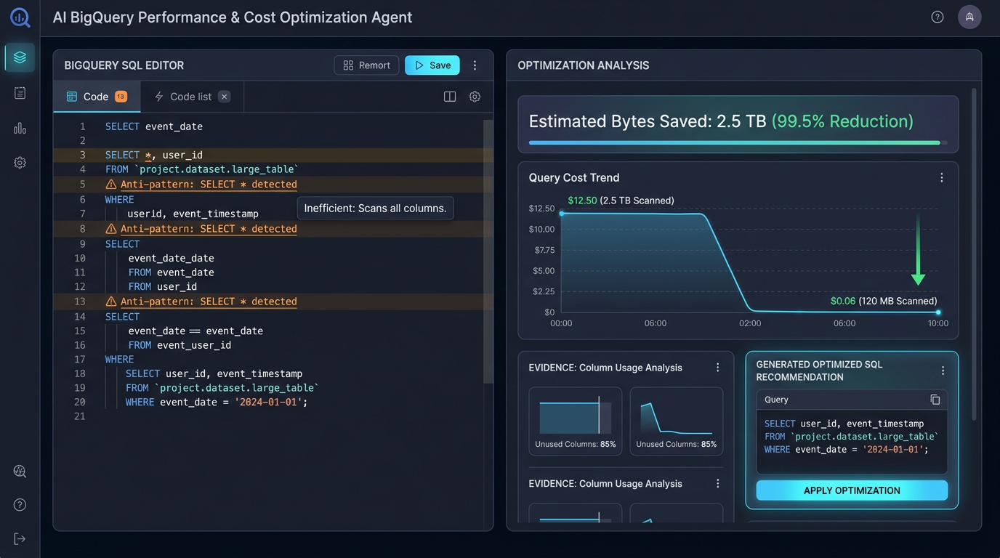
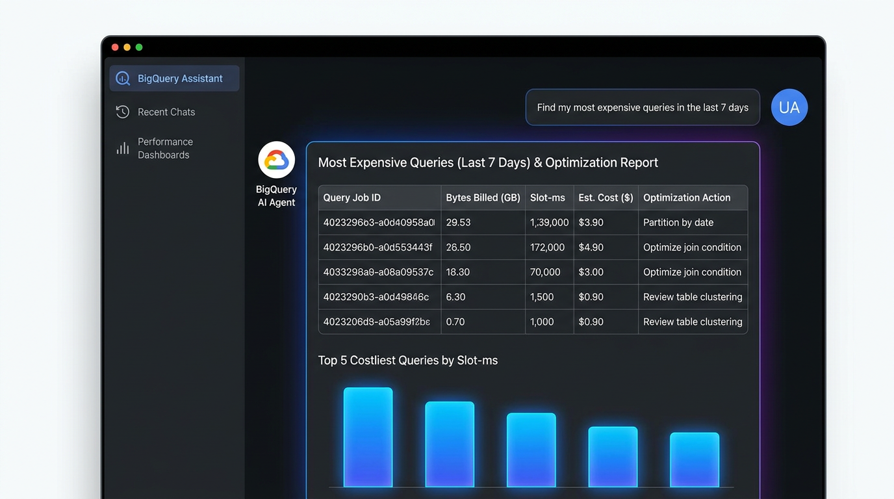

# BigQuery Performance & Cost Optimization Agent

[](https://github.com/vimalsagar007/bigquery-performance-cost-optimization-agent/actions)
[](https://opensource.org/licenses/MIT)
[](https://www.python.org/downloads/)
[](https://bq-agent-61256100941.us-central1.run.app/docs)
[](postman/BigQuery_Optimization_Agent.postman_collection.json)

An enterprise-grade, AI-powered **BigQuery Performance and Cost Optimization Agent** built with Python 3.12+, FastAPI, Google Cloud BigQuery SDK, `google-genai` (Gemini on Vertex AI), and LangGraph.

The agent analyzes SQL query structure, BigQuery `INFORMATION_SCHEMA` execution history, dataset/table partitioning and clustering metadata, slot usage, and performance insights to identify cost anti-patterns and performance bottlenecks—delivering actionable, evidence-backed optimization recommendations.

---

## 🚀 Live Production Deployment & Postman Testing

- **Live Service URL**: [https://bq-agent-61256100941.us-central1.run.app](https://bq-agent-61256100941.us-central1.run.app)
- **Interactive Playground / Docs**: [https://bq-agent-61256100941.us-central1.run.app/docs](https://bq-agent-61256100941.us-central1.run.app/docs)
- **Postman Collection**: [postman/BigQuery_Optimization_Agent.postman_collection.json](postman/BigQuery_Optimization_Agent.postman_collection.json)
- **Postman Testing Guide**: [docs/postman-testing-guide.md](docs/postman-testing-guide.md)

---

## Visual Dashboards & Evidence Screenshots

### Optimization Analysis Dashboard


### AI Assistant Chat & Query History Interface


---

## ⚠️ Important Safety Requirement (Version 1 Read-Only)

> **Version 1 IS STRICTLY READ-ONLY.**
> - The agent **NEVER** modifies, deletes, updates, or overwrites BigQuery production data.
> - Data Modification (DML/DDL) statements (`INSERT`, `UPDATE`, `DELETE`, `MERGE`, `DROP`, `ALTER`, `CREATE`, `TRUNCATE`) are rejected at the AST parser level before reaching BigQuery.
> - Generated optimization SQL is displayed **solely as a recommendation** and is **NEVER** executed automatically.

---

## Architecture Diagram

```
                                  +---------------------------------------+
                                  |            Client Applications        |
                                  |    (HTTP API / CLI / Web Console)     |
                                  +-------------------+-------------------+
                                                      |
                                                      v
                                  +-------------------+-------------------+
                                  |         FastAPI Web Service           |
                                  |        (app/main.py & routes)         |
                                  +-------------------+-------------------+
                                                      |
                                                      v
                                  +-------------------+-------------------+
                                  |       LangGraph Agent Coordinator     |
                                  |         (app/agents/graph.py)         |
                                  +-------------------+-------------------+
                                                      |
              +-------------------+-------------------+-------------------+-------------------+
              |                   |                   |                   |                   |
              v                   v                   v                   v                   v
     +-----------------+ +-----------------+ +-----------------+ +-----------------+ +-----------------+
     | SQL AST & Rules | | BigQuery Client | |  Dry-Run Engine | | Gemini AI Engine| | Safety Guardrail|
     | (sql_analyzer)  | |(bigquery_tools)| |  (dry_run.py)   | |(gemini_service) | | (sql_validator) |
     +-----------------+ +-----------------+ +-----------------+ +-----------------+ +-----------------+
              |                   |                   |                   |                   |
              +-------------------+-------------------+-------------------+-------------------+
                                                      |
                                                      v
                                  +-------------------+-------------------+
                                  |          Google Cloud Platform        |
                                  |    BigQuery & INFORMATION_SCHEMA      |
                                  +---------------------------------------+
```

---

## Key Features

- **28 Core BigQuery Tools**: Table metadata, partition/clustering inspector, `INFORMATION_SCHEMA` query history analyzer, AST parser, dry-run engine, cost estimator, slot-ms usage analyzer, and refactoring generator.
- **Strict Read-Only Guardrails**: Proactively blocks non-read query types (`INSERT`, `UPDATE`, `DELETE`, `DROP`, etc.).
- **Zero-Cost Dry-Run Estimations**: Calculates bytes scanned and estimated costs before running analysis queries.
- **LangGraph Agent Orchestration**: Multi-node workflow handling intent detection, metadata analysis, cost/performance evaluation, and evidence validation.
- **Gemini on Vertex AI Reasoning**: Leverages `google-genai` SDK with strict grounding instructions to eliminate metric hallucination.
- **Natural Language `/chat` Endpoint**: Answers questions like *"Find my most expensive queries in the last 7 days"* or *"Optimize this SQL"*.

---

## Postman Collection Endpoints

| # | Endpoint | Method | Purpose |
|---|---|---|---|
| 1 | `/health` | GET | Operational health check & read-only status |
| 2 | `/query/dry-run` | POST | Zero-cost dry run byte scan calculation |
| 3 | `/analyze/query` | POST | Anti-pattern detection & evidence report |
| 4 | `/history/expensive` | GET | Top expensive queries from INFORMATION_SCHEMA |
| 5 | `/history/slow` | GET | Top slow queries ranked by slot-ms |
| 6 | `/table/metadata` | GET | Table partition & clustering inspector |
| 7 | `/optimize` | POST | Generates refactored SQL & comparison metrics |
| 8 | `/chat` | POST | Gemini-powered natural language chat agent |

---

## Quickstart & Live API Examples

### Dry-Run Query (`POST /query/dry-run`)
```bash
curl -X POST "https://bq-agent-61256100941.us-central1.run.app/query/dry-run" \
     -H "Content-Type: application/json" \
     -d '{"sql": "SELECT * FROM `bigquery-public-data.usa_names.usa_1910_current`"}'
```

### Analyze Query (`POST /analyze/query`)
```bash
curl -X POST "https://bq-agent-61256100941.us-central1.run.app/analyze/query" \
     -H "Content-Type: application/json" \
     -d '{"sql": "SELECT * FROM `bigquery-public-data.usa_names.usa_1910_current` LIMIT 10"}'
```

### Natural Language Chat (`POST /chat`)
```bash
curl -X POST "https://bq-agent-61256100941.us-central1.run.app/chat" \
     -H "Content-Type: application/json" \
     -d '{"message": "How do I optimize queries with SELECT * on BigQuery public datasets?"}'
```

---

## Testing & Evaluation

### Run Unit & Integration Tests (100% Pass Rate)
```bash
pytest tests/ -v
```

### Run 20-Case Agent Evaluation Suite (100% Accuracy)
```bash
python eval/run_eval.py
```

---

## License

MIT License - Copyright (c) 2026 Vimal Sagar ([@vimalsagar007](https://github.com/vimalsagar007))
